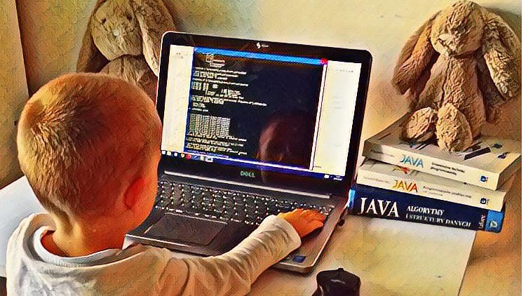

# Spring Intro

Repozytorium warsztatowe z zadaniami wprowadzającymi do świata Springa (dla Spring Framework 5 i Spring Boot 2)

---

## O repozytorium

Drogi Użytkowniku, repozytorium z którego korzystasz jest w pełni darmowe i dostęp do niego do niczego Cię nie zobowiązuje. Repozytorium to jest efektem ciężkiej pracy autora i kilku lat doświadczeń w prowadzeniu zajęć ze Spring Framework w polskich szkołach programowania. Było najwyżej oceniane przez wielu uczestników szkoleń i ze wszystkich w ten sposób przeze mnie przygotowanych zasłużyło na miano ... arcyrepozytorium :)

Jeżeli Ci się spodoba i zaczniesz z niego korzystać to daj proszę gwiazdkę (_star na górze_) i dorzuć łacza (_watch na górze_), aby niczego nowego nie przegapić!

---

## O autorze

Nazywam się Michał i od 20 lat programuję w języku Java. Od 9 lat robię to zawodowo. Pracowałem zarówno ze stosem technologicznym Java EE (5/6/7) jak i Spring (4/5). Od ponad dwóch lat jestem trenerem programowania ... podobno jednym z najlepszych w Polsce :)

Więcej o moich doświadczeniach dowiesz się tutaj: [LinkedIn](https://www.linkedin.com/in/michal-kupisinski)

---

## Wspomóż

Jednym z najbardziej wymagających uczniów jakich miałem w życiu była moja żona. Nie koniecznie przez opór materiału i trudności komunikacyjne, ale przez brak czasu na Jej nauczanie. Nasza rodzina nie kończy się na naszej dwójce :) Stąd jedyny sposób, aby mogła się nauczyć programowania było przygotowanie dla Niej materiałów do nauki, najlepszych na świecie. Efekt wspólnego wysiłku zamknęliśmy ostatecznie w kursie z podstaw programowania. Bez wątpienia najlepszym jaki jest :)

Jeżeli uważasz, że taki kurs mógłby być dla Ciebie pomocny albo znasz kogoś dla kogo byłby pomocny (szczególnie na początku drogi), to skorzystaj lub poleć poniższy link:

[Promocja: 50 godzin materiału najlepszej jakości w cenie 4 x CD-Action = 48,99 PLN](https://www.udemy.com/course/programowanie-w-javie-solidne-fundamenty/?couponCode=9BDD279891B9C7B313E5) <- Promocja ważna do 3 czerwca 2020

**Dziękuję za Twoje wsparcie i życzę Ci miłej pracy z tym repozytorium**

---

## Błędy i poprawki

Repozytorium może zawierać drobne błędy... były one wprowadzane specjalnie, aby móc o nich dyskutować w trakcie zajęć stacjonarnych. Obecny tryb udostępnienia repozytorium nie umożliwia takiej pracy, więc błędy są eliminowane... ale jakieś drobne może gdzieś pozostały. Jak będę miał pewność, że nie ma już żadnych to tą notę usunę.

---

## Zmiany

Repozytorium w ciągu najbliższych dni i tygodni będzie uzupełniane o brakujące rozwiązania i prawdopodobnie dalsze rozszerzenia. Bądź czujny i zaglądaj tutaj co jakiś czas :)

---

## Przygotowanie repozytorium

1. Repozytorium należy w pierwszej kolejności sforkować na swoje konto.
1. Utworzony fork należy skolonować poleceniem `git clone adres_twojego_forka`

   > Możesz też sklonować bezpośrednio główne repozytorium ale wtedy możliwa jest tylko praca lokalna na komputerze z repozytorium
   
1. Projekt, który jest opisany w repozytorium należy zrealizować w katalogu `project`.
1. W katalogu `project` znajduje się również referencyjny projekt (`honestit/demo`), który możesz śmiało wykorzystać.

---

## Wprowadzenie

W ramach warsztatów zrealizujemy wspólnie prostą aplikację bazującą na Spring Framework. Będzie to serwis webowy umożliwiający użytkownikom publikacje ogłoszeń. 

Aplikacja będzie zawierała następujący zestaw funkcjonalności:

1. Obsługa użytkowników
   1. Rejestracja nowych użytkowników
   1. Logowanie
   1. Wylogowanie
   
1. Obsługa ogłoszeń
   1. Lista ostatnio dodanych ogłoszeń na stronie głównej
   1. Lista wszystkich ogłoszeń zalogowanego użytkownika
   1. Lista wszystkich ogłoszeń wybranego użytkownika
   
... i więcej!
   
W trakcie prac nad tą prostą aplikacją wprowadzimy sobie podstawowe zagadnienia i techniki związane z:
1. **Spring Core/Context** - do obsługi wstrzykiwania zależności (IoC/DI),
1. **Spring MVC** - do obsługi żądań protokołu HTTP, w architekturze MVC,
1. **Spring Boot** - do szybkiego startu i automatycznej konfiguracji projektu,
1. **Spring Data JPA** - do integracji ze standardem JPA i obsługi warstwy bazodanowej,
1. **JSP** - do generowania dynamicznych widoków.
1. **Spring Security** - do obsługi warstwy bezpieczeństwa

---

## Moduł 1. Podstawowa konfiguracja projektu

W pierwszej kolejności zajmiemy się przygotowaniem projektu do dalszych prac. Musimy zadbać o to, aby w naszym projekcie:
- pojawiły się wszystkie zależności,
- pojawiły się wszystkie wymagane konfiguracje.

[Rozpocznij pracę z modułem](module_1/README.md)

---

## Moduł 2. Proces rejestracji i logowania

Mamy podstawową konfigurację projektu i udało nam się go uruchomić. Będziemy realizować teraz kolejne funkcjonalności, a zaczniemy od rejestracji użytkownika oraz procesu logowania/wylogowania.

Potrzebować będziemy:
- klasy reprezentującej użytkownika, np. `User`,
- klasy kontrolera Spring MVC obsługującej proces rejestracji, np. `RegistrationController`,
- strony JSP z widokiem formularza rejestracji,
- strony JSP z widokiem formularza logowania i jej obsługi w kontrolerze.

[Rozpocznij pracę z modułem](module_2/README.md)

---

## Moduł 3. Dodawanie ogłoszeń i lista ogłoszeń

W ramach zadań zrealizujemy dalszy zestaw funkcjonalności związany z obsługą ogłoszeń użytkowników. Zaczniemy od opcji dodania ogłoszenia oraz listy wszystkich ogłoszeń. Następnie przejdziemy do listy ogłoszeń per użytkownik oraz list ogłoszeń zalogowanego użytkownika. W ramach zadań dodatkowych możemy również wprowadzić edycję ogłoszenia oraz opcję jego usunięcia.

[Rozpocznij pracę z modułem](module_3/README.md)

---

## Moduł 4. Rozszerzenia architektoniczne i technologiczne

W ramach tej dodatkowej sekcji zrealizujemy zestaw rozszerzeń projektu, które w pierwszej kolejności będą poprawiały architekturę naszej aplikacji (rozszerzały ją), a w drugiej wprowadzały dodatkowe zagadnienia techniczne usprawniające i czyniące cały projekt bardziej atrakcyjny _w oczach innego programisty_.

[Rozpocznij pracę z modułem](module_4/README.md)

---

### Dziękuję za wspólną pracę ;)
